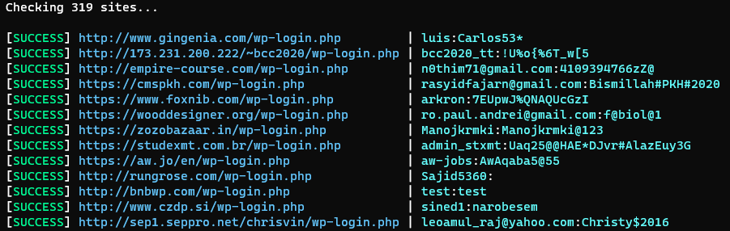

# WordCheck-By-Lore<3

### Wordpress checker that attempts to login wordpress site's admin panel using credentials provided in the list

## Required text file format ::  https://site.com/wp-login.php username:password




### Project written in the same format as https://github.com/PyLore/MC-Name-Checker-By-Lore

## ℹ️Features:
* Downloads a list of proxies

## 🔌 How To Install:
```bash
1. git clone https://github.com/PyLore/WordCheck
2. cd <directory folder is in>
3. py main.py or python3 main.py
```
